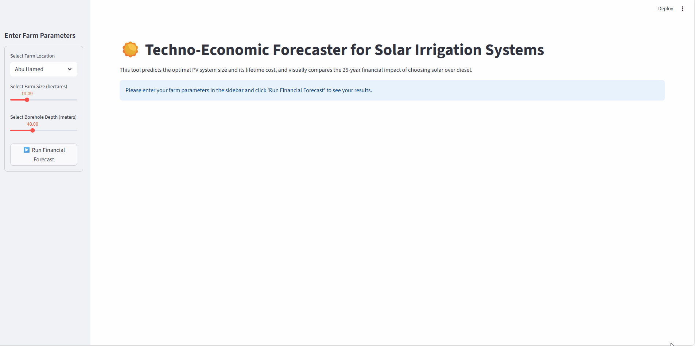
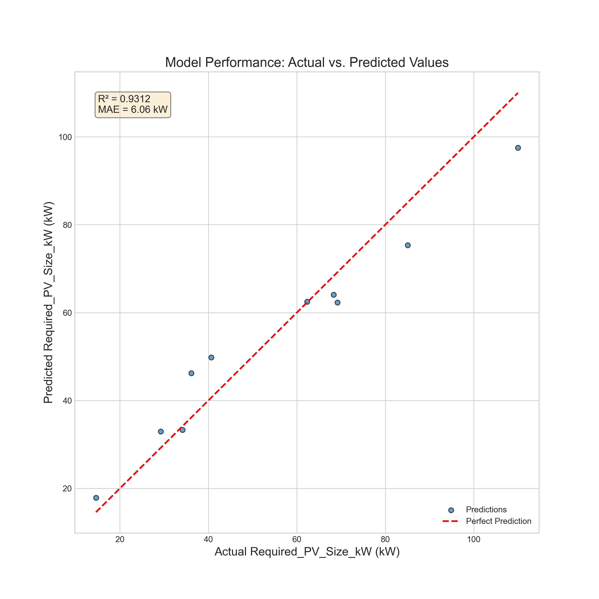
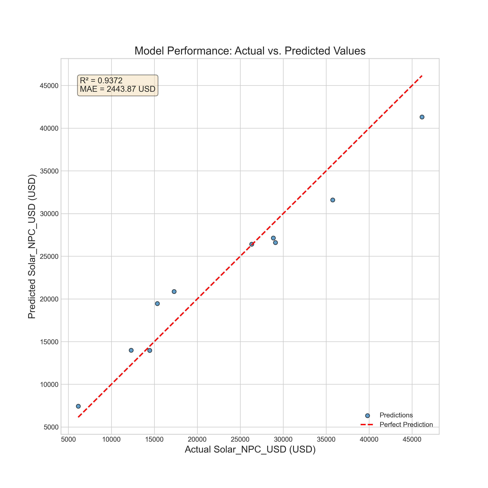

# Techno-Economic Forecaster for Solar Irrigation Systems



## 1. From Thesis to Tool: The Project's Mission

This project began with a question from my B.Sc. thesis in Mechanical Engineering: *What is the real, long-term financial impact of switching from diesel to solar-powered irrigation for farmers in Sudan?* After a deep analysis using professional simulation tools, the answer was clear: the switch to solar offered massive savings and environmental benefits.

But this discovery revealed a new problem: the analysis itself was slow, complex, and required expensive software, making the insights inaccessible to the very people who needed them most.

This project's mission is to solve that problem. **I extended my thesis research, leveraging my data science and machine learning skills, to build a tool that makes it easy for small-scale farmers and agricultural planners to see the benefits of solar energy for themselves.**

The result is this interactive web application. It transforms a complex, multi-day engineering analysis into an instant, data-driven forecast, empowering users to make informed decisions about their energy future.

## 2. The Core Finding: Why This Matters

The foundational research for this project uncovered a clear and compelling business case for solar adoption.

**[View the full thesis here.](https://github.com/hishamsalih2000/academic-work/blob/main/BSc_Thesis_Solar_Energy_Feasibility_Study.pdf)**

Key findings from the thesis showed that, over a 25-year lifespan, a solar-powered system:
*   **Is over 3.5 times cheaper** in total lifetime cost (NPC) than its diesel equivalent ($12,890 vs. $45,177).
*   **Reduces annual operating costs by over 97%**, eliminating reliance on volatile fuel markets.
*   **Avoids approximately 4.67 metric tons of CO2 emissions annually.**

This ML-powered tool was built to bring these powerful conclusions directly into the hands of decision-makers.

## 3. The Technical Workflow

To transform the manual simulation process into a predictive model, I followed a three-phase workflow:

**Phase 1: Data Generation & Automation**
1.  **Simulation Blueprint:** A plan was created to generate 50 unique scenarios, varying farm location, size, and borehole depth, based on the validated methodology from the thesis.
2.  **Input Automation:** A Python script was developed to automate the creation of 50 unique, hourly load profile (`.dmd`) files for HOMER Pro.
3.  **Simulation Execution:** Each scenario was simulated in HOMER Pro to find the optimal PV system configuration.
4.  **Data Persistence:** The final, cleaned dataset was written to a persistent **SQLite database**, moving the project from a flat-file system to a more robust, queryable data storage solution.

**Phase 2: Professional Model Training**
A robust training pipeline was built using Scikit-learn, incorporating best practices like `Pipelines` for preprocessing, `RandomizedSearchCV` for hyperparameter tuning, and 5-fold cross-validation for reliable evaluation.

**Phase 3: Deployment**
The two final, trained models (one for PV size, one for cost) were integrated into this interactive Streamlit web application.

## 4. Model Performance

The models demonstrate strong predictive power and have learned the correct underlying physical and economic relationships from the data.

### Model 1: PV System Size Predictor
*   **Best Cross-Validated R²:** 0.7796
*   **Final Test Set R²:** 0.9312
*   **Final Test Set MAE:** 6.06 kW



### Model 2: Solar Net Present Cost (NPC) Predictor
*   **Best Cross-Validated R²:** 0.7734
*   **Final Test Set R²:** 0.9372
*   **Final Test Set MAE:** 2443.87 USD




## 5. How to Run This Project

1.  Clone this repository.
2.  Create and activate the conda environment:
    ```bash
    conda create --name solar-forecaster python=3.9
    conda activate solar-forecaster
    ```
3.  Install the required libraries:
    ```bash
    pip install -r requirements.txt
    ```

4.  To create the database with the data:
    ```bash
    python -m src.aggregate_results
    ```
5.  To re-run the model training pipeline:
    ```bash
    python -m src.train_model
    ```
6.  To launch the web application:
    ```bash
    streamlit run app.py
    ```